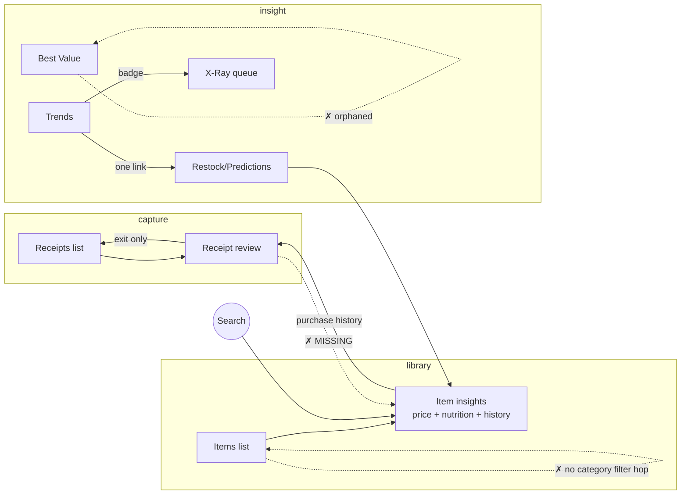

# Navigation & Information Architecture

*Drafted 2026-07-10. Basis: every page route in `app/api/pages.py`, the nav in `templates/layouts/base.html`, and a grep of every `href`/`hx-get`/`window.location` across templates and API-rendered fragments.*

**Design premise:** this is a web app pretending to be desktop software. That sets the bar for navigation: persistent chrome that always tells you where you are, entity pages that behave like documents you can hop between, no dead ends, no full-page reloads that reset your context, and keyboard-reachable search. The app already nails some of this (HTMX fragments, the search dropdown, item insights as a hub). This document maps what exists, names what's broken, and proposes the target structure.

---

## 1. The app as it is today

### 1.1 Top navigation (base.html)

| Entry | Route | Desktop | Mobile |
|---|---|:---:|:---:|
| Dashboard | `/` | ✓ | ✓ |
| Receipts | `/receipts` | ✓ | ✓ |
| **Quick Produce** (bold green) | `/produce` | ✓ | ✓ |
| Items | `/items` | ✓ | ✓ |
| Trends | `/trends` | ✓ | ✓ |
| Categories | `/categories` | ✓ | ✓ |
| Settings (gear icon) | `/settings` | ✓ | **✗ missing** |
| Global search | dropdown → `/search` | ✓ | **✗ missing** |

Two immediate defects, independent of any redesign:

- **The nav has no active state.** Every link carries identical classes; nothing indicates the current page. Desktop software never leaves you guessing which document is focused.
- **Mobile loses Settings and search entirely.** Search is the app's best granular entry point (your words, and the code agrees — it's the shortest path to any item), and it doesn't exist on phones.

### 1.2 Full route inventory

| Route | Page | How you get there | Verdict |
|---|---|---|---|
| `/` | Dashboard | nav | overloaded (see §2.2) |
| `/receipts` | Receipt list + upload + paste | nav | good hub |
| `/receipts/bulk` | Bulk upload | link on Receipts | fine as spoke |
| `/receipts/{id}/review` | Review sandbox | Receipts, Dashboard, Item insights | **dead-ends back to `/receipts` only** |
| `/produce` | Quick Produce entry | nav (top-level, bold) | over-promoted input tool |
| `/items` | Item library (All / Duplicates / Search / Dismissed tabs) | nav | good hub, weak edit flow |
| `/items/{id}/insights` | Item hub: price sparkline, purchase history → receipts, nutrition facts, nutrient editor | Items, search, restock, shopping list | **the best page in the app — everything should route here** |
| `/categories` | Category management | nav | admin tool with top-level billing |
| `/trends` | Global filters, spend trajectory, nutrition trends, store diff | nav | overloaded (see §2.2) |
| `/restock` | **Predictions**: stats, restock table, optimized shopping list | a single link on Trends | **hidden gem #1** |
| `/xray` | Nutrition match queue | coverage badges on Dashboard/Trends | **hidden gem #2** |
| `/best-value/{type}` | Best-value ranking tables | **nothing links to it** | **orphan** |
| `/search?q=` | Full search results page | search dropdown | good |
| `/settings` | Exclusions, OCR filters, USDA toggle, danger zone | gear icon (desktop only) | fine |
| `/styleguide` | Design system reference | link on Settings | fine (dev tool) |
| `/demo-bi` | BI chart demo | **nothing links to it** | orphan (dev tool) |

### 1.3 The entity link graph

The data model has a natural spine: **Receipt → Line item → Item → Nutrition / Price history → Receipts again.** Here's which hops exist:



**The loop you like — receipt → item → nutrition → back — only works in one direction.** Item insights → purchase history → receipt review exists. But receipt review has *zero* links to item insights (verified: no `insights` href in `receipt_review.html` or `receipts_fragments.py`). Once you're looking at a receipt, every item name on it is inert text. The round trip dies there.

### 1.4 Search

`/api/search` searches **items only** (name match + latest purchase context), rendered as a dropdown with a full results page behind it. It's fast, it's granular, and every result deep-links to item insights. This is the strongest navigation primitive in the app — and it's desktop-only and mouse-first (no keyboard shortcut to focus it, no arrow-key result selection).

---

## 2. What's wrong, precisely

### 2.1 Hidden gems, buried or orphaned

1. **Predictions (`/restock`) is one of the most differentiated features in the product** — restock forecasting plus a store-optimized shopping list — and it is reachable through exactly one link, on Trends, a page you'd visit for a different reason. It has no nav presence, no dashboard presence beyond charts.
2. **X-Ray (`/xray`)** is the workflow for raising nutrition coverage (the #1 item on the current backlog) and is only reachable by noticing a small badge.
3. **Best Value (`/best-value/*`)** is fully built — endpoint, pagination, page template — and nothing links to it. It's dead code with a pulse.
4. **`/demo-bi`** and **`/styleguide`** are dev tools; orphaning is fine, but they should be deliberately grouped (see §3.5) rather than accidentally scattered.

### 2.2 Dashboard and Trends are two names for the same idea

Both pages independently answer "how am I doing?":

| Content | Dashboard | Trends |
|---|:---:|:---:|
| Spend over time | weekly + monthly bar charts | weekly spend trajectory |
| Nutrition analytics | dollar-by-nutritional-profile, protein ROI, spend-vs-protein trend, category efficiency matrix, basket composition, small multiples by store, budget bullet | caloric split, nutrient small multiples, coverage badge |
| Store comparison | store spend table, category-store stack | identical-item store diff, store top items |
| Category breakdown | top categories table | basket spend composition |

The Dashboard has absorbed an entire BI suite (it renders **eleven** chart/table sections) and duplicates most of what Trends does with different visualizations. Neither page has a distinct job, so neither can be the obvious answer to "where do I look for X?" A dashboard in desktop software is a *lobby*, not the archive.

### 2.3 The Items edit flow is mislabeled and jarring

On an item card, the button labeled **"Edit"** opens a form containing exactly one field: **Category** — and saving triggers a full `location.reload()`. Meanwhile:

- The API (`PUT /api/items/{id}`) already supports renaming; no UI exposes it on the card.
- Real item editing (nutrition, enrichment) lives on the insights page, which the card links to under the unrelated label "Insights."
- The full-page reload throws away your scroll position and tab state — the single most "this is a website, not software" moment in the app.

So the user-facing model is backwards: "Edit" edits the least item-like property (its shelf assignment), while the item's actual home page isn't presented as where you edit it.

### 2.4 Top-level billing is misallocated

- **Quick Produce** — a manual-entry accelerator, i.e. an *input tool* — has top-level nav placement with bold green styling, the loudest item in the bar.
- **Categories** — taxonomy administration you touch occasionally — has top-level placement.
- **Predictions, X-Ray, Best Value** — recurring-value insight pages — have none.

The nav currently ranks plumbing above product.

---

## 3. Proposed architecture

### 3.1 The model: three verbs and a lobby

Everything the app does is one of three verbs — **Capture** (get data in), **Library** (curate entities), **Insights** (learn something) — plus Settings. The proposed nav makes those the spine:

```
┌──────────────────────────────────────────────────────────────────────┐
│ 🛒 Grocery Tracker   [🔍 Search ⌘K]      Dashboard  Receipts  Items  │
│                                           Insights ▾   [+ Add ▾]  ⚙  │
└──────────────────────────────────────────────────────────────────────┘

Dashboard   →  /                lobby: status + jump-offs (slimmed, §3.3)
Receipts    →  /receipts        capture archive (bulk stays a spoke)
Items       →  /items           library (tabs: All · Duplicates · Dismissed · Categories)
Insights ▾  →  /trends          Trends (spend + stores)
               /restock         Predictions & Shopping List
               /best-value      Best Value
               /xray            Nutrition X-Ray
[+ Add ▾]   →  Upload receipt · Paste text · Quick Produce · Bulk import
⚙           →  /settings       (+ Style Guide, BI demo under a "Developer" card)
```

Six top-level targets instead of seven, but the real change is what they *are*:

- **`+ Add` is a global action button, not a place.** Desktop software puts "New…" in the toolbar on every screen. Upload, paste-text, Quick Produce, and bulk import are all the same verb with different inputs — one split-button holds them all, available from anywhere. Quick Produce loses its nav slot but becomes *more* accessible (reachable from any page, not just via the nav bar).
- **Insights is a group, not a page.** A dropdown (desktop) / section (mobile drawer) containing Trends, Predictions, Best Value, and X-Ray. All four gems get equal, discoverable billing without widening the bar. Within each of those pages, a shared sub-nav strip (`Trends · Predictions · Best Value · X-Ray`) makes them feel like tabs of one analytical workspace.
- **Categories becomes a tab on Items.** It's item curation — it belongs beside Duplicates and Dismissed, not in the top bar. (The route can stay; the nav entry goes.)

### 3.2 Close the entity loop (highest-value change in this doc)

Rule: **every entity name rendered anywhere is a link to that entity's hub.**

| Entity | Hub | Status |
|---|---|---|
| Item | `/items/{id}/insights` | hub exists; add missing inbound links |
| Receipt | `/receipts/{id}/review` | hub exists; add missing outbound links |
| Category | `/items?category={id}` (new filter param) | needs the filter |
| Store | `/trends?store={name}` (filter exists conceptually in Global Filters) | wire the deep link |

Concretely:

1. **Receipt review line items link to item insights** for any line matched to a known item (auto-merged or suggestion-accepted). This single change completes the receipt → item → nutrition → receipts loop in both directions. For unmatched lines, no link — the absence itself communicates "this item isn't in your library yet."
2. **Item insights gets a proper header block**: editable name (the API already takes it), category pill that's a dropdown, next to the nutrition source badge. Insights *is* the item editor; stop pretending otherwise.
3. **The Items card "Edit" button goes away.** The card keeps: History (popover), Insights (primary action, restyled as the card's title link — clicking an item's *name* should open its page, the most basic desktop convention), USDA Match. Category reassignment moves to a pill dropdown directly on the card — no form, no `location.reload()`, just an HTMX PATCH and a swapped badge.
4. **Category names everywhere** (top-categories table, item cards, basket composition legend) link to the filtered Items view.

### 3.3 Give Dashboard and Trends distinct jobs

- **Dashboard = lobby.** It answers "what's my status and what needs my attention?" in one screen: this month's spend vs last, receipts awaiting review, restock urgents (top 3, linking to `/restock`), nutrition coverage (linking to `/xray`), recent receipts. Everything else — the eleven-section BI suite — moves out.
- **Trends absorbs the deep analytics**, organized by question: *Spending* (trajectory, budget bullet, category-store stack), *Stores* (store diff, top items, small multiples), *Nutrition* (caloric split, protein ROI, efficiency matrix, macro trends). The existing Global Filters strip becomes the shared controller for all three sections — it's already the right pattern, it just needs more of the charts under its authority.
- Rule of thumb going forward: **a chart appears on exactly one page.** If the Dashboard wants to advertise it, it gets a stat-tile that links there, not a copy.

This also pays an engineering debt: the monster `dashboard.html` shrinks, and the analytics duplication between `analytics.py` and `trends.py` gets a natural seam.

### 3.4 Promote search to a command palette

Search is already the app's best pathfinder; make it the universal one:

- **Keyboard**: `/` or `Ctrl/⌘-K` focuses it from any page; arrow keys + Enter navigate results (the dropdown already exists — this is keybindings, not new UI).
- **Mobile**: a search icon in the header opening a full-width overlay. This is the single biggest mobile navigation fix available.
- **Scope, later**: today it searches items only. Extending to receipts (by store/date) and categories would make it a true "Go to Anything…" — worthwhile, but the keyboard + mobile work pays off first.

### 3.5 Consistency rules (the "desktop software" contract)

1. **Active nav state**: the current section is visually marked (`aria-current="page"` + accent). One-line template change per link.
2. **No dead ends**: every page below the top level shows a breadcrumb (`Insights › Predictions`; `Items › Organic Bananas`). Receipt review's exit buttons return to wherever you came from (referrer-aware or `?from=` param), not unconditionally to `/receipts`.
3. **No full-page reloads for edits**: `location.reload()` is banned for state changes; HTMX partial swaps only. (Currently used by the items edit form and parts of insights.)
4. **Mobile parity**: the drawer contains everything the desktop bar does — including Settings and search.
5. **Dev tools grouped**: Style Guide and BI Demo listed under a "Developer" card in Settings, so orphaning is a choice, not an accident.

---

## 4. The flows, before → after

**"What is this item I keep buying, and is it good for me?"**
- *Before*: Search → insights ✓ (already great — this flow is the template for the rest)
- *After*: identical, plus reachable on mobile and by keyboard.

**"Review this receipt… wait, what's the price history on that item?"**
- *Before*: Review → (dead end) → nav → Items → find item → Insights. Four hops with a search detour.
- *After*: Review → click the item's name → Insights → back-breadcrumb to the same review. One hop each way.

**"What do I need to buy this week?"**
- *Before*: know that the link exists on Trends → Restock.
- *After*: Dashboard restock tile → Predictions, or Insights ▾ → Predictions. Two obvious paths.

**"Recategorize these five items."**
- *Before*: Items → per item: Edit → dropdown → Save → full reload → scroll back down → repeat.
- *After*: Items → click each card's category pill → pick → done. No reloads, position preserved.

---

## 5. Implementation plan — SHIPPED 2026-07-10

All four phases below were implemented, tested (83/83 passing, live page sweep), and the
precompiled CSS rebuilt. Notes record what was found during implementation.

**Phase A — defects ✅**
1. ✅ Active-state styling + `aria-current` on nav links (desktop + mobile).
2. ✅ Settings and search added to the mobile menu.
3. ✅ Receipt-review line items link to item insights. Saved receipts carry the item id directly; unsaved sandbox items are resolved server-side by normalized name at render time (`pages.py`).
4. ✅ Item editing rationalized: the card's "Edit" button (category-only + full reload) is gone — the category pill *is* now the editor (a styled `<select>` that PATCHes in place), the card title links to insights, and insights already had full name+category editing behind its hover pencil.

**Phase B — rebalance the nav ✅**
5. ✅ Insights dropdown + shared sub-nav strip (`components/insights_subnav.html`) on Trends/Predictions/Best Value/X-Ray. Best Value additionally gained a category switcher (produce/meat/dairy/pantry/beverages) since nothing selected its category before.
6. ✅ `+ Add` split-button (Upload · Paste text · Quick Produce · Bulk); Quick Produce and Categories removed from the top bar; Categories is now an Items tab (the `/categories` route still works). `+ Add → Paste` deep-links via `/receipts?paste=1`, which auto-opens the paste modal.
7. ✅ Breadcrumb on bulk import; review exits honor a same-site `?from=` param (insights and dashboard links pass it).

**Phase C — content moves ✅**
8. ✅ Dashboard diet — and an autopsy: of the dashboard's Budget×Nutrition BI section, only the macro-breakdown card was real. The KPI row was hardcoded fake numbers, and rows 2–5 (dual-axis, efficiency matrix, basket donut, small multiples, bullet charts) rendered *synthetic demo arrays* (the code admitted it: "synthetic — wire to live API endpoints to ship"). The live macro card moved to Trends' nutrition section (`components/nutrition_bi.html`), the protein-ROI card — whose API data existed but was never rendered — is now actually wired up with items deep-linking to insights, and the synthetic remainder was deleted (~280 lines). The dashboard got a 4-tile Insights jump-row instead. Also removed: `analytics_bi_injection.py`, a dead unimported duplicate of the BI endpoint.
9. ✅ Category pills as dropdowns on item cards; `/items?category=` filter with a clear-chip; category names link to the filtered view from the Categories tab and the top-categories table; top-items table rows now link to item insights.

**Phase D — search upgrade ✅ (10, 11) / open (12)**
10. ✅ `/` or Ctrl/⌘-K focuses search; arrow keys walk the results; Enter follows.
11. ✅ Mobile search lives at the top of the hamburger menu.
12. ⬜ (Later) widen scope to receipts and categories.

---

*Bottom line: the app's pages are individually strong — item insights in particular is exactly the hub a desktop app needs — but the connective tissue ranks input tools over insight pages, hides its two best features behind single links, duplicates its analytics across two homes, and breaks the receipt↔item loop halfway. Every fix above is wiring, not construction: the destinations all exist; they just need the doors.*
